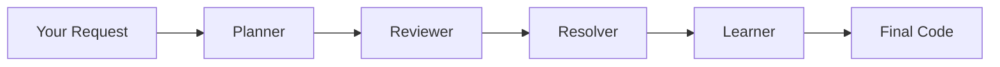

# The Dialectic Pipeline

The heart of Dial Code's safety system - a multi-stage review process that ensures higher-quality code changes.

---

## Overview

When changes go through **Review** or **Safe** mode, they pass through four stages:



Each stage adds a layer of scrutiny and refinement.

---

## The Four Stages

### 1. Planner

**Creates the implementation plan.**

The Planner:

- Analyzes your request
- Identifies affected files
- Creates code patches
- Documents the approach

Output: A detailed plan with proposed changes.

---

### 2. Reviewer

**Critically examines the plan.**

The Reviewer checks for:

- Logic errors
- Security vulnerabilities
- Edge cases
- Performance issues
- Code style violations
- Missing error handling

Output: List of issues, concerns, and suggestions.

---

### 3. Resolver

**Reconciles the plan with reviewer feedback.**

The Resolver:

- Addresses each concern
- Refines the implementation
- Produces the final code
- Documents changes made

Output: Final, refined implementation.

---

### 4. Learner

**Extracts patterns for future reference.**

The Learner:

- Identifies what worked well
- Notes common issues found
- Updates context for future tasks
- Improves future suggestions

Output: Patterns stored for future sessions.

---

## When It Activates

| Mode   | Pipeline Active |
| ------ | --------------- |
| Ask    | No              |
| Quick  | No              |
| Review | Yes (light)     |
| Safe   | Yes (full)      |

**Review mode**: Faster pipeline, focused on major issues.
**Safe mode**: Thorough pipeline, comprehensive review.

---

## Watching the Pipeline

During execution, you'll see progress:

```
[◎] Review mode active

[Planner] Analyzing request...
[Planner] Creating implementation plan...
[Reviewer] Checking for issues...
[Reviewer] Found 2 suggestions
[Resolver] Addressing feedback...
[Resolver] Finalizing code...
[Learner] Extracting patterns...

Ready for approval.
```

---

## Benefits

### Catches Issues Early

The Reviewer stage catches problems before they reach your codebase:

- SQL injection vulnerabilities
- Missing null checks
- Race conditions
- Incomplete error handling

### Higher Quality Code

Multiple perspectives lead to better implementations:

- Cleaner code structure
- Better error messages
- More robust edge case handling
- Improved documentation

### Continuous Learning

The Learner stage means Dial Code gets better:

- Remembers your coding patterns
- Avoids past mistakes
- Suggests consistent solutions

---

## Configuration

Control pipeline behavior in `.dial/settings.json`:

```json
{
  "dialectic": {
    "reviewDepth": "standard",
    "learnerEnabled": true
  }
}
```

Options:

| Setting          | Values                          | Description             |
| ---------------- | ------------------------------- | ----------------------- |
| `reviewDepth`    | `light`, `standard`, `thorough` | Review intensity        |
| `learnerEnabled` | `true`, `false`                 | Enable pattern learning |

---

## Example Flow

**Request**: "Add rate limiting to the API endpoint"

**Planner**:

```
Plan: Add rate limiting middleware
- Create rateLimiter.js
- Import in app.js
- Apply to /api routes
```

**Reviewer**:

```
Issues found:
1. No configuration for rate limits
2. Missing Redis store for distributed systems
3. No bypass for health checks
```

**Resolver**:

```
Updated implementation:
- Added configurable limits
- Added Redis store option
- Excluded /health endpoint
```

**Learner**:

```
Pattern stored: Rate limiting implementations
should include configuration options and
exclude health check endpoints.
```

---

## Next Steps

- [Execution Modes](execution-modes.md) - When each mode is used
- [Tools](tools.md) - Capabilities used by the pipeline
