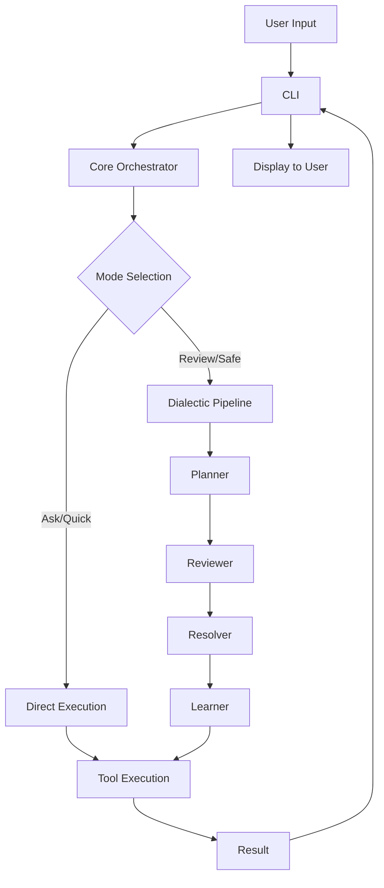

# Architecture

High-level overview of Dial Code's system design.

---

## Package Structure

Dial Code uses a monorepo architecture with four packages:

```
packages/
├── cli/      # Frontend - Terminal UI
├── core/     # Backend - AI orchestration
├── test-utils/  # Shared testing utilities
└── vscode-ide-companion/  # IDE integration
```

---

## packages/cli

The user-facing terminal interface.

### Responsibilities

- Input processing and command parsing
- Terminal rendering with React/Ink
- History and session management
- Theme and UI customization
- Settings and configuration UI

### Key Directories

```
cli/src/
├── components/   # React/Ink UI components
├── commands/     # Slash command handlers
├── settings/     # Settings management
├── utils/        # CLI utilities
└── index.ts      # Entry point
```

### Technologies

- **React 19** + **Ink 6** for terminal UI
- **Yargs** for command-line parsing
- **Zod** for validation

---

## packages/core

The AI orchestration engine.

### Responsibilities

- LLM provider integration
- Multi-agent dialectic system
- Tool execution and safety
- Session and context management
- MCP protocol handling

### Key Directories

```
core/src/
├── agents/       # Dialectic agents (proposer, critic, etc.)
├── orchestrator/ # Task execution and mode management
├── providers/    # LLM provider adapters
├── tools/        # Tool implementations
├── mcp/          # Model Context Protocol
├── memory/       # Context management
└── telemetry/    # Analytics
```

### Agent System

```
agents/
├── base-agent.ts       # Common interface
├── proposer-agent.ts   # Creates solutions (thesis)
├── critic-agent.ts     # Identifies issues (antithesis)
├── synthesizer-agent.ts # Reconciles views (synthesis)
└── reflector-agent.ts  # Learns from results
```

### Orchestrator

```
orchestrator/
├── dialectic-controller.ts  # Pipeline orchestration
├── mode-selector.ts         # Mode auto-selection
├── mode-escalation.ts       # Mode escalation logic
├── task-analyzer.ts         # Task complexity analysis
└── execution-coordinator.ts # Execution management
```

---

## Data Flow



---

## LLM Provider Architecture

```
providers/
├── base-provider.ts    # Common interface
├── qwen-provider.ts    # Qwen implementation
├── openai-provider.ts  # OpenAI-compatible
└── gemini-provider.ts  # Google Gemini
```

All providers implement a common interface:

```typescript
interface LLMProvider {
  generateResponse(prompt: string, options: Options): Promise<Response>;
  streamResponse(prompt: string, options: Options): AsyncIterable<Chunk>;
  listModels(): Promise<Model[]>;
}
```

---

## Tool System

### Tool Interface

```typescript
interface Tool {
  name: string;
  description: string;
  inputSchema: JSONSchema;
  requiresConfirmation: boolean;
  execute(params: unknown): Promise<ToolResult>;
}
```

### Built-in Tools

| Category    | Tools                                   |
| ----------- | --------------------------------------- |
| File System | read_file, write_file, edit, glob, grep |
| Execution   | run_shell_command                       |
| Web         | web_fetch, web_search                   |
| Memory      | save_memory, todo_write                 |

---

## MCP Integration

```
mcp/
├── client.ts       # MCP client implementation
├── transport.ts    # Communication layer
└── tool-adapter.ts # Convert MCP tools to internal format
```

---

## Design Principles

### 1. Separation of Concerns

CLI handles presentation; Core handles logic. They communicate through well-defined interfaces.

### 2. Provider Agnostic

The core system works with any LLM provider that implements the interface.

### 3. Safety by Default

All file modifications and shell commands require confirmation unless explicitly disabled.

### 4. Extensibility

The tool system and MCP support allow adding new capabilities without modifying core code.

### 5. Testability

Each package has comprehensive tests. Integration tests verify end-to-end behavior.

---

## Next Steps

- [Contributing](contributing.md) - How to contribute
- [Building](building.md) - Development setup
